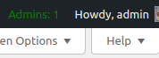
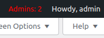

# Tj Admin Counter

## Description

Tj Admin Counter is a WordPress plugin that displays the current number of administrators in the WordPress admin bar. It highlights the count in green if there is only one admin and in red if there are more. Additionally, the plugin sends a daily email notification to the first administrator if there are multiple administrators.

## Installation

1. Upload the `tj-admin-counter` directory to the `/wp-content/plugins/` directory.
2. Activate the plugin through the 'Plugins' menu in WordPress.

## Usage

Once activated, you will see a counter in the admin bar indicating the number of administrators.

## Features

- Provides a quick overview of the number of administrators.
- Customizable colors based on the number of administrators.

## Screenshots

*Number Administrator account 1 in green color.*
 

*Number Administrator account more than 1 in red color.*

## Frequently Asked Questions

### Can I customize the colors?

Yes, you can. The plugin uses green for a single admin and red for more than one. You can modify the CSS styles in the `main.css` file.

## License

This plugin is open-source and available under the [MIT License](LICENSE).

## Contributing

Contributions are welcome! Feel free to open issues or submit pull requests.

## Credits

- Tamjid (https://github.com/tee-jaay) - Author

## Changelog

### 0.0.1
- Initial release

### 0.0.2
- Added email notification functionality for the first admin.
  - An email is sent when there is more than one administrator.
  - Maximum one email per day.
  - Counter link to WP Users page's administrator tab.
  - Hover color for the link.

### 0.0.3
- Remove visiblity from non-admins.
